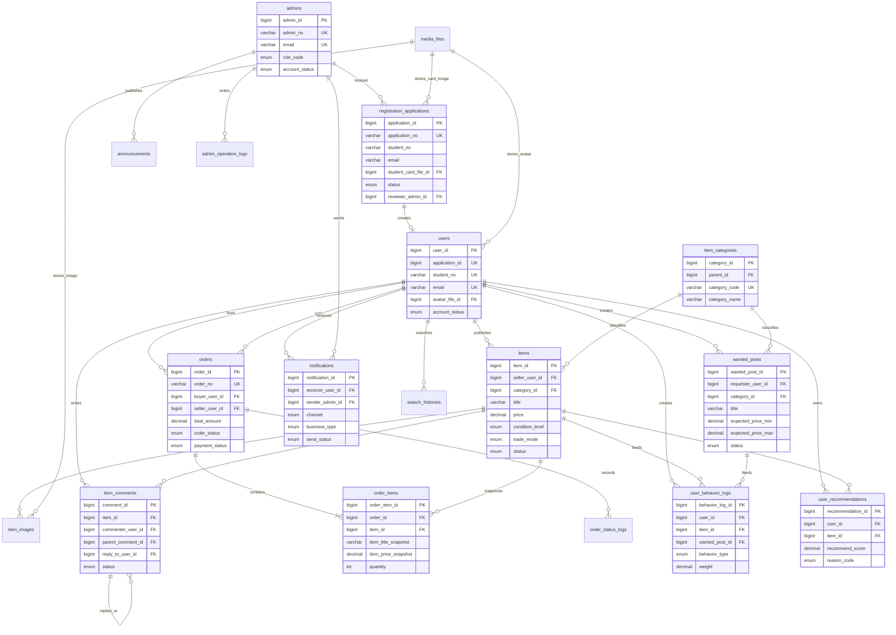

# Database ERD

## Overall scope

This schema is designed for a campus second-hand trading system under a B/S architecture.
The design keeps the OLTP core in 3NF, while allowing a few controlled denormalized fields
such as `items.view_count`, `items.comment_count`, and snapshot fields in `order_items`.

## Core ERD

## Module notes

### Registration and approval

- `registration_applications` stores all pending, approved, rejected, and cancelled registration requests.
- `users` is created only after approval.
- `notifications` supports both on-site and email notifications for review results.

### Item publishing and browsing

- `items` is the core listing table.
- `item_images` supports multiple pictures and a cover image.
- `item_categories` is reusable for both sale listings and wanted posts.
- Full-text indexes are provided for item title, brand, model, and description search.

### Trading

- `orders` stores order headers for online cash-on-delivery purchases.
- `order_items` stores immutable listing snapshots, protecting history if a listing later changes.
- `order_status_logs` stores the order state transition trail.

### Recommendation

- `search_histories` and `user_behavior_logs` are the main upstream data sources.
- `user_recommendations` stores materialized recommendation results for fast homepage retrieval.
